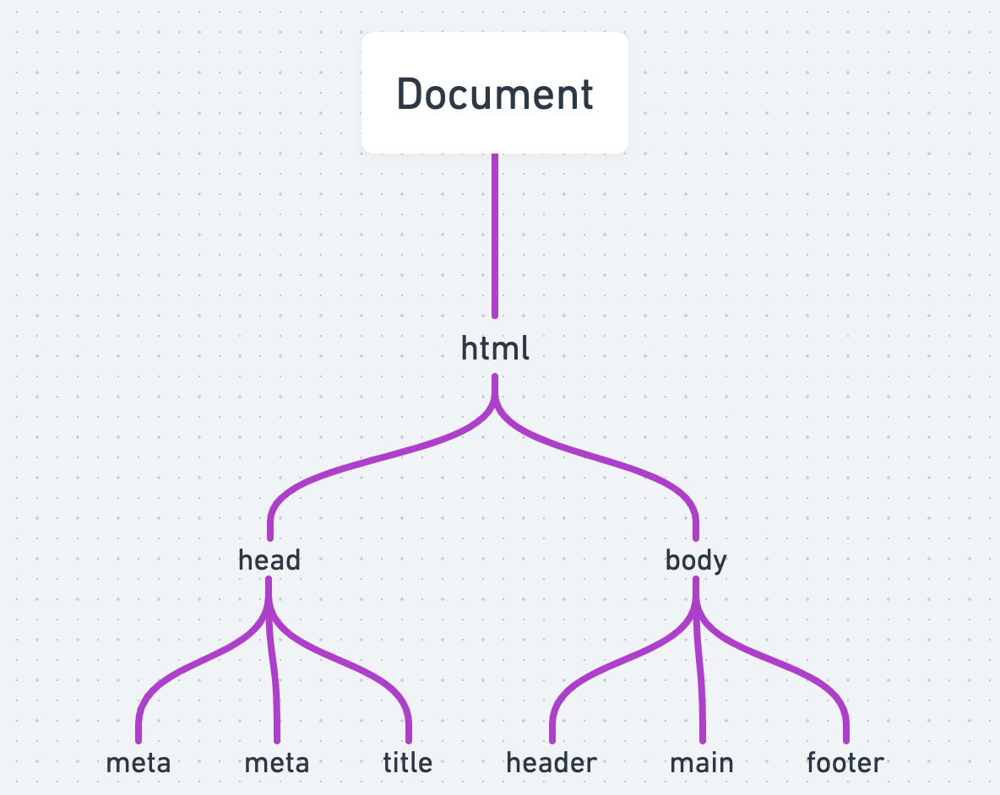

# DOM (Document Object Model)

## What is the DOM?

- The DOM is a programming interface for HTML and XML documents.
- It represents the page so that programs can change the document structure, style, and content.
- The DOM represents the document as nodes and objects. That way, programming languages can connect to the page.
- The DOM is an object-oriented representation of the web page, which can be modified with a scripting language such as JavaScript.
- It has properties and methods for accessing and interacting with all the elements of an HTML document.

## Visualizing the DOM



- The DOM is a tree-like structure of nodes and objects.
- Each node is an object representing a part of the document.
- The top node is the document object.
- The document object has child nodes, which are HTML elements.
- The HTML elements have child nodes, which are more HTML elements or text nodes.

## Selecting Elements

- getElementById()

```js
const title = document.getElementById("title");
```

- getElementsByTagName()

```js
const listItems = document.getElementsByTagName("li");
```

- getElementsByClassName()

```js
const listItems = document.getElementsByClassName("list-item");
```

- querySelector()

```js
// id title
const title = document.querySelector("#title");
```

- querySelectorAll()

```js
// class list-item
const listItems = document.querySelectorAll(".list-item");
```

## Manipulating Elements

- textContent

```js
const title = document.querySelector("#title");
title.textContent = "New Title";
```

- innerHTML

```js
const listItems = document.querySelectorAll(".list-item");
listItems[0].innerHTML = "<strong>First</strong> list item";
```

- innerText
  ```js
  const listItems = document.querySelectorAll(".list-item");
  listItems[0].innerText = "First list item";
  ```
- value

```js
const input = document.querySelector("input");
input.value = "New Value";
```

- manipulate attributes (setAttribute(), getAttribute(), removeAttribute())

```js
const link = document.querySelector("a");
link.setAttribute("href", "https://www.google.com");

link.getAttribute("href"); // https://www.google.com

link.removeAttribute("href");
```

- style

```js
const title = document.querySelector("#title");
title.style.color = "red";
title.style.fontSize = "2rem";
```

- classList (add(), remove(), toggle())

```js
const title = document.querySelector("#title");
title.classList.add("red");
title.classList.remove("red");
title.classList.toggle("red"); // add if not present, remove if present
```

## Navigate between Elements

- parentNode

```js
const listItems = document.querySelectorAll(".list-item");
listItems[0].parentNode; // <ul>
```

- parentElement

```js
const listItems = document.querySelectorAll(".list-item");
listItems[0].parentElement; // <ul>
```

- childNodes

```js
const listItems = document.querySelectorAll(".list-item");
listItems[0].childNodes; // [text, <li>, text]
```

- firstElementChild

```js
const listItems = document.querySelectorAll(".list-item");
listItems[0].firstElementChild; // <li>
```

- lastElementChild

```js
const listItems = document.querySelectorAll(".list-item");
listItems[0].lastElementChild; // <li>
```

- nextElementSibling

```js
const listItems = document.querySelectorAll(".list-item");
listItems[0].nextElementSibling; // <li>
```

- previousElementSibling

```js
const listItems = document.querySelectorAll(".list-item");
listItems[0].previousElementSibling; // null
```

## Creating Elements

- createElement()

```js
const newListItem = document.createElement("li");
```

- append()

```js
const list = document.querySelector("ul");
list.append(newListItem); // add as last child
```

- prepend()

```js
const list = document.querySelector("ul");
list.prepend(newListItem); // add as first child
```

- insertBefore()

```js
const list = document.querySelector("ul");
const listItems = document.querySelectorAll(".list-item");
list.insertBefore(newListItem, listItems[2]); // add before third child
```

## Events

- Add event listeners on HTML

```html
<button onclick="alert('Hello World!')">Click Me</button>
```

- Add event listeners with JavaScript

```js
const button = document.querySelector("button");
button.addEventListener("click", () => {
  alert("Hello World!");
});
```

### Keyboard Events

- keydown

```js
const input = document.querySelector("input");
input.addEventListener("keydown", (event) => {
  console.log(event.key);
});
```

- keyup

```js
const input = document.querySelector("input");
input.addEventListener("keyup", (event) => {
  console.log(event.key);
});
```

- keypress
  ```js
  const input = document.querySelector("input");
  input.addEventListener("keypress", (event) => {
    console.log(event.key);
  });
  ```

### Mouse Events

- click

```js
const button = document.querySelector("button");
button.addEventListener("click", () => {
  alert("Hello World!");
});
```

- dblclick

```js
const button = document.querySelector("button");
button.addEventListener("dblclick", () => {
  alert("Hello World!");
});
```

- mousedown

```js
const button = document.querySelector("button");
button.addEventListener("mousedown", () => {
  alert("Hello World!");
});
```

- mouseup
  ```js
  const button = document.querySelector("button");
  button.addEventListener("mouseup", () => {
    alert("Hello World!");
  });
  ```
- mouseover
  ```js
  const button = document.querySelector("button");
  button.addEventListener("mouseover", () => {
    alert("Hello World!");
  });
  ```
- mouseout
  ```js
  const button = document.querySelector("button");
  button.addEventListener("mouseout", () => {
    alert("Hello World!");
  });
  ```

### Event Argument

- event.target
  ```js
  const button = document.querySelector("button");
  button.addEventListener("click", (event) => {
    console.log(event.target); // <button>Click Me</button> element clicked!
  });
  ```
- event.key
  ```js
  const input = document.querySelector("input");
  input.addEventListener("keypress", (event) => {
    console.log(event.key); // Enter, a, b, c, ...
  });
  ```
